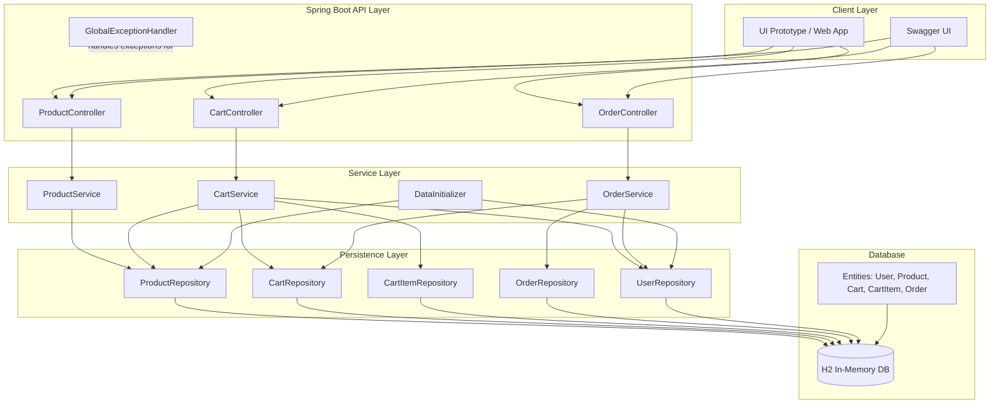
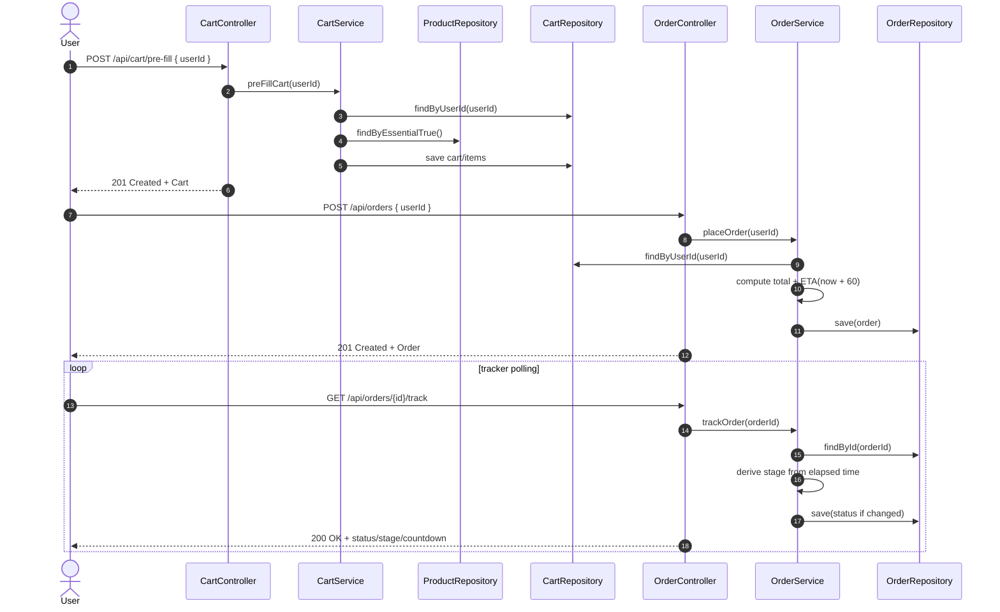
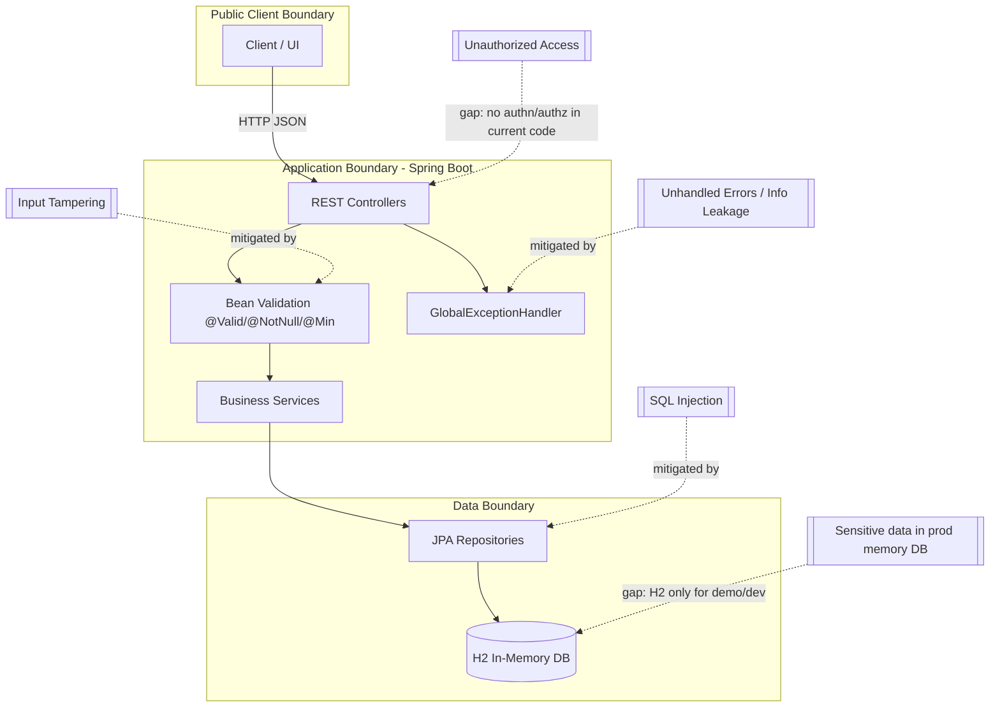

# 60-Minute Cart Diagrams

This document provides architecture, flow, sequence, and security diagrams for the implemented Spring Boot backend.

## 1) Architecture Diagram


Raw Mermaid source: `docs/diagrams/architecture.mmd`

## 2) Flow Diagram
```mermaid
flowchart TD
    A[Client starts 60-Minute Cart flow] --> B[GET /api/products/essentials]
    B --> C[Display essentials cards in UI]

    C --> D{User action}
    D -->|Pre-fill| E[POST /api/cart/pre-fill]
    D -->|Add/Update item| F[POST /api/cart/items]

    E --> G[CartService loads user and essentials]
    F --> H[CartService upserts cart item]

    G --> I[Cart updated in H2]
    H --> I

    I --> J[POST /api/orders]
    J --> K[OrderService calculates total]
    K --> L[Set estimatedCompletionTime = now + 60 min]
    L --> M[Persist order with PLACED status]

    M --> N[GET /api/orders/{id}/track]
    N --> O{Elapsed time since order placement}
    O -->|< 20 min| P[PLACED]
    O -->|20-44 min| Q[PICKING_ESSENTIALS]
    O -->|45-59 min| R[READY_FOR_PICKUP]
    O -->|>= 60 min| S[DELIVERED]

    P --> T[Return trackerStage + remainingSeconds]
    Q --> T
    R --> T
    S --> T
```

Raw Mermaid source: `docs/diagrams/flow.mmd`

## 3) Sequence Diagram


Raw Mermaid source: `docs/diagrams/sequence.mmd`

## 4) Security Diagram


Raw Mermaid source: `docs/diagrams/security.mmd`
